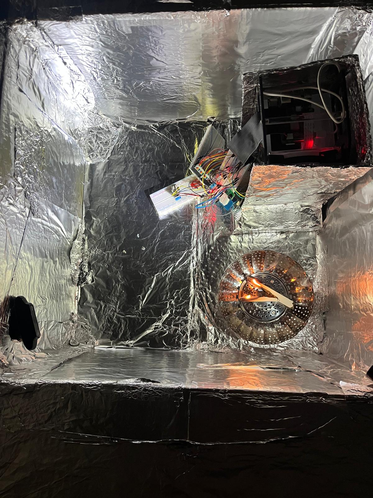
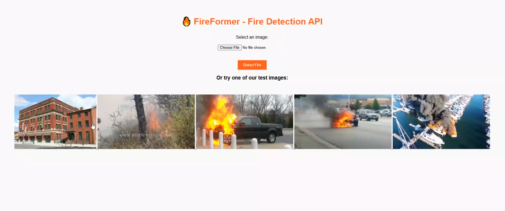
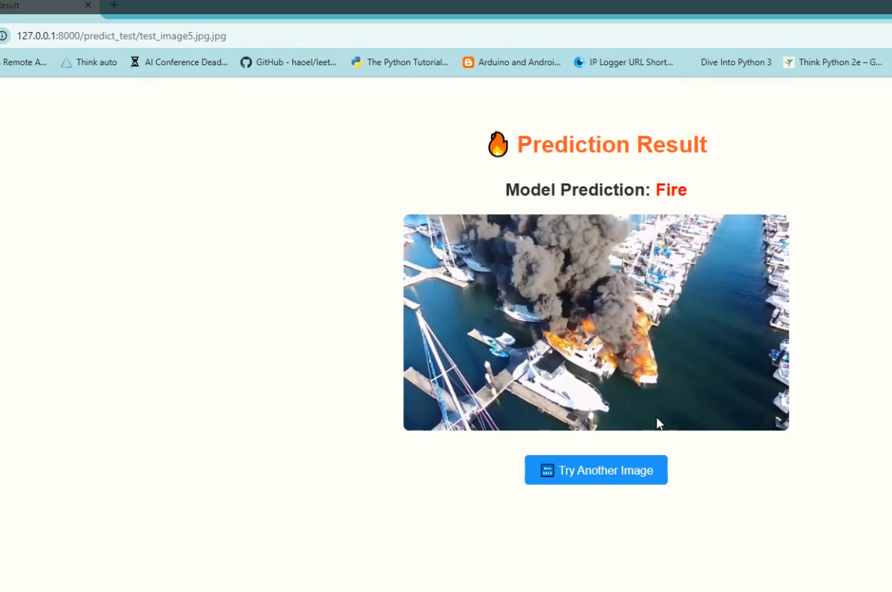
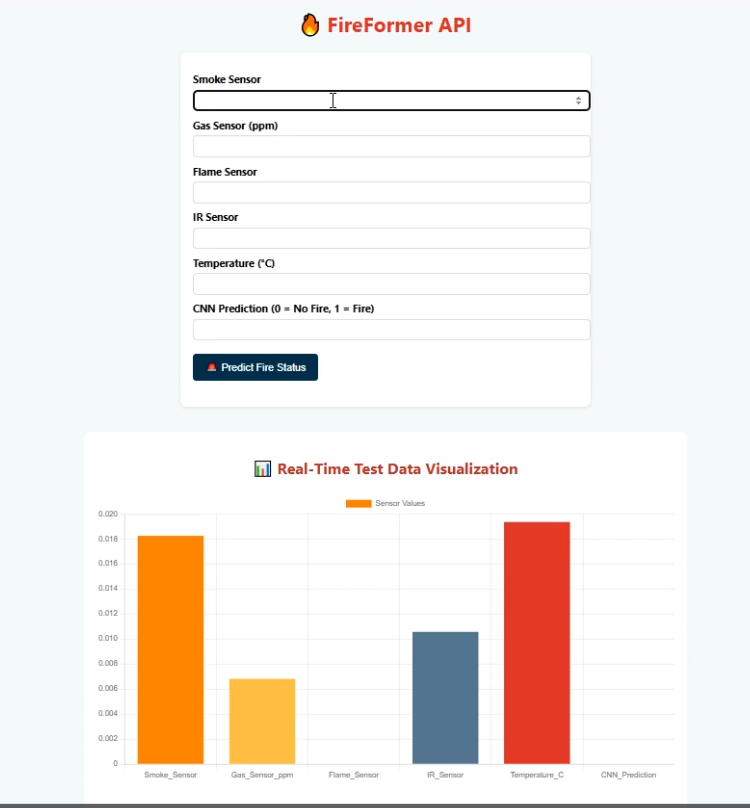
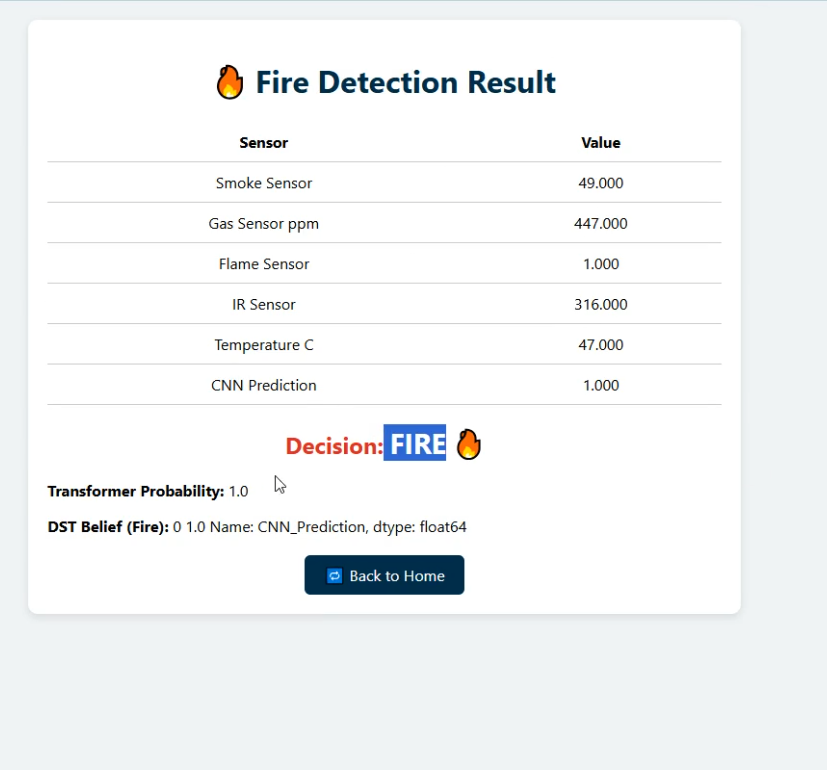
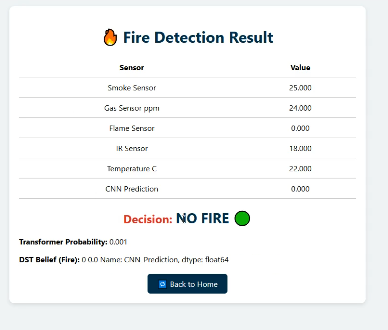

# 🔥 FireFormer: Multimodal Fire Intelligence Framework

This repository supports the research paper titled:  
**"A Multimodal Framework for Reliable Fire Intelligence via Visual–Sensor Models and Synopsis-Driven Fusion Using Dempster–Shafer Theory"**  
(Submitted to *IEEE Transactions on Industrial Informatics*).

---

## 📦 Overview

This project introduces a real-time, multimodal fire detection and decision-making system that integrates:

- `FireSentryV3`: A CNN-based fire image classification model trained on 15 diverse classes.
- `FireFormer`: A Transformer-based model that processes multivariate time-series data from gas, smoke, flame, infrared, and temperature sensors.
- `DST Fusion`: Combines outputs from both models with sensor data using **Dempster–Shafer Theory**.
- `Synopsis Generation`: Compresses meaningful fire event data for post-analysis and storage optimization.

---

## 🔧 Experimental Setup

  

The data was collected using a custom-made aluminum foil–lined fire container. Sensor data was recorded over **11 days** under both **fire** and **non-fire** conditions.

- **Devices Used**:
  - 2 Raspberry Pi 5 boards for sensor data acquisition
  - 1 Raspberry Pi for camera module & API transmission
  - Custom-built **memristor-based gas sensor** for enhanced gas detection

---

## 📷 FireSentryV3 (Fire Image Classification API)

FireSentryV3 is trained on a **15-class image dataset**, covering 14 real-world fire scenarios and 1 non-fire category.  
The API allows image upload or test image selection.

  

**Prediction Output:**

  

---

## 🌡️ FireFormer + DST Decision API

The second API allows users to input live sensor data and receive a combined CNN + Transformer + DST-based fire status.

  

**Fire Decision Result (Fire):**

  

**Fire Decision Result (No Fire):**

  

---

## 📹 Demonstration Videos

The following videos demonstrate API functionality:

- 🔍 **Fire Image Classification (FireSentryV3)**  
- 🔁 **Sensor Fusion and DST Fire Decision (FireFormer + DST)**  

👉 [**Watch API Working Video**](https://drive.google.com/file/d/1VTaWr-ia6uK9t6HoaYrKlwDpoUcaVdWH/view?usp=drive_link)  
👉 [**Sensor Dataset**](https://drive.google.com/file/d/17oPw8458RQolE-f0YxzGmV3YmXW7XbDi/view?usp=drive_link)

---

## 🧪 Data Collection Process

- **Sensors Used**: Smoke, Flame, Temperature, Infrared, Custom Memristor-Based Gas Sensor
- **Sample Rate**: 11 continuous days
- **Export Format**: CSV logs per session with timestamp, raw sensor values, and CNN prediction labels

---

## 🔐 Note

The codebase for model training and API deployment is currently under private review. Only demo videos and sample data logs are shared. Final code will be released upon acceptance.

---

## 💡 Citation

Please cite our work if you find this useful (citation format will be updated post-publication).
